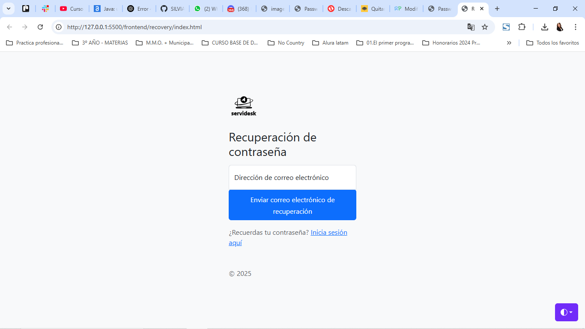
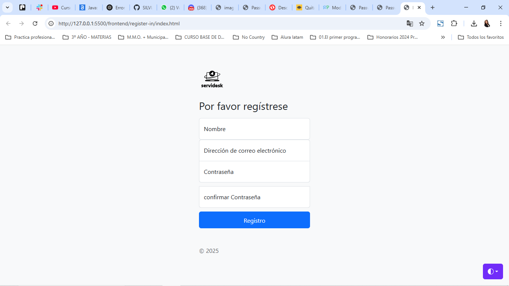
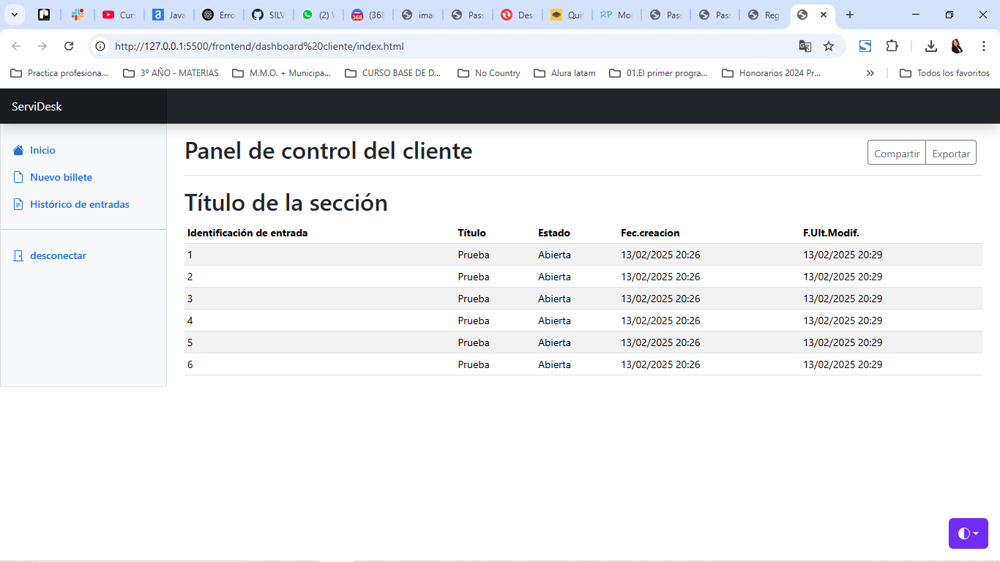
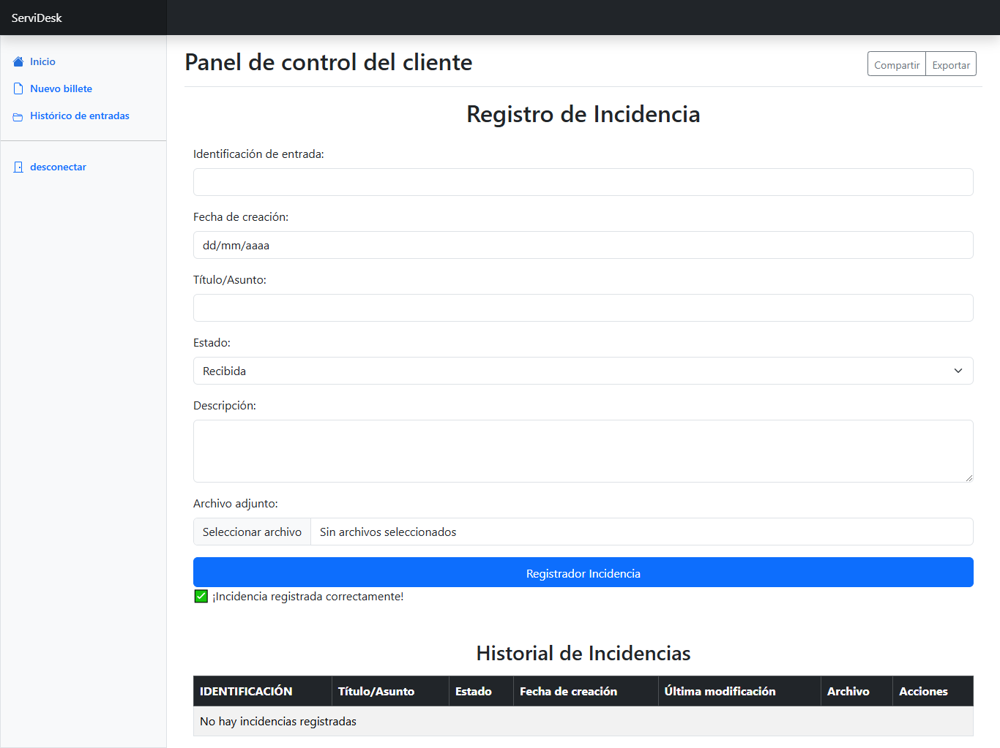

# ServiDesk
Las soluciones SaaS permiten a los usuarios acceder a aplicaciones basadas en la nube sin necesidad de descargarlas.  Ventajas de las soluciones SaaS  Ahorro de costos Mayor accesibilidad Actualizaciones sin esfuerzo Integración perfecta Flexibilidad y productividad Almacenamiento seguro de datos en la nube

Pantalla de inicio de sesion

Pantalla de recuperacion contraseña

Pantalla registro de usuario

Dashboard Cliente

Pantalla ticket

